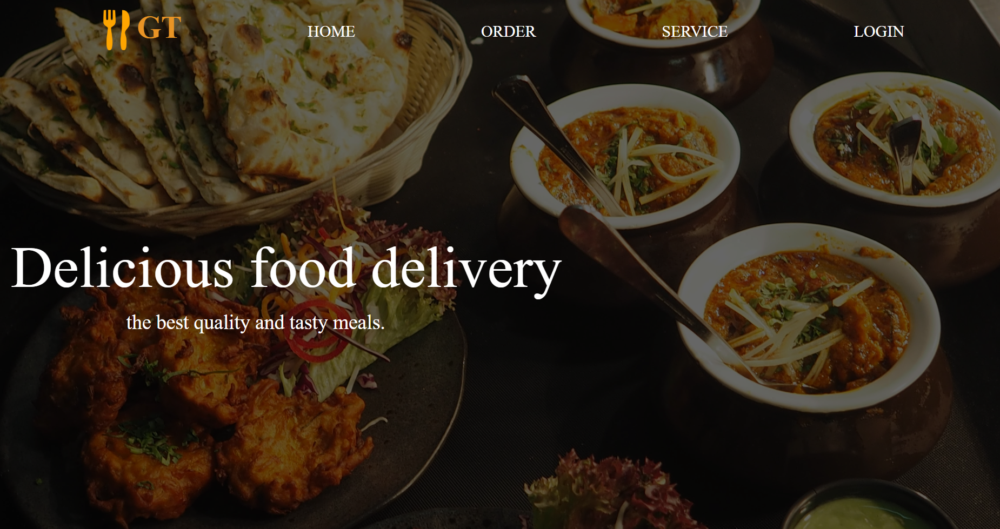
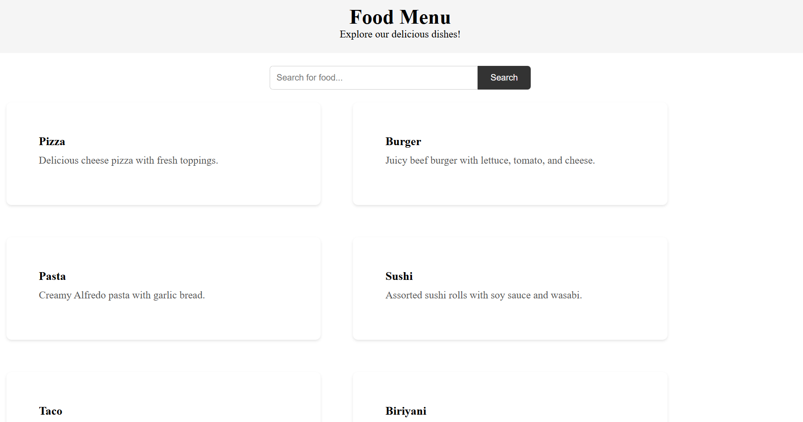
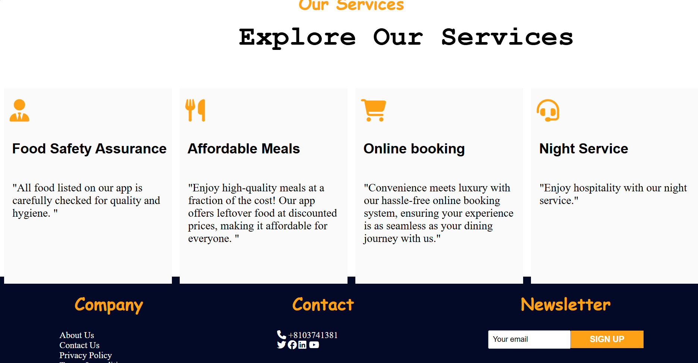

# Give & Take 🎯

## Basic Details
### Team Name: Tech Trio

### Team Members
- Member 1: Diya Saira Charly - Amal Jyothi College of Engineering 
- Member 2: Aleta Johnson - Amal Jyothi College of Engineering 
- 

### Hosted Project Link
[mention your project hosted project link here]

### Project Description
Leftover food delivery app

### The Problem statement
Reduction of food wastage

### The Solution
By creating a website 

## Technical Details
### Technologies/Components Used
For Software:
html
css
javascript

### Implementation
For Software:
# Installation
[commands]

# Run
[commands]

### Project Documentation
For Software:

# Screenshots (Add at least 3)

*Add caption explaining what this shows*

*Add caption explaining what this shows*

*Add caption explaining what this shows*

# Diagrams

*Add caption explaining your workflow*

For Hardware:

# Schematic & Circuit

*Add caption explaining connections*

*Add caption explaining the schematic*

# Build Photos

*List out all components shown*

*Explain the build steps*

*Explain the final build*

### Project Demo
# Video
[https://drive.google.com/file/d/1MQCX1jbIm37mdEj01o4zWSkGmoFhVQOY/view?usp=sharing

# Additional Demos
[Add any extra demo materials/links]

## Team Contributions
- Diya Saira Charly: [Coding and web development
- Aleta Johnson: Problem statement and presentation
- [Name 3]: [Specific contributions]

---
Made with ❤️ at TinkerHub
